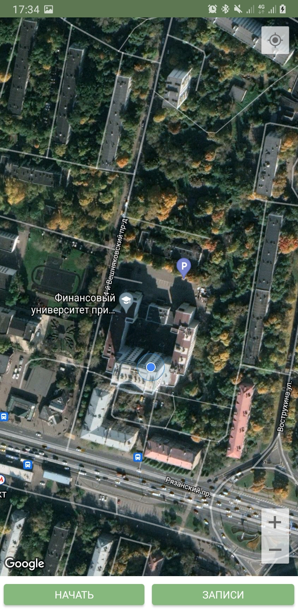
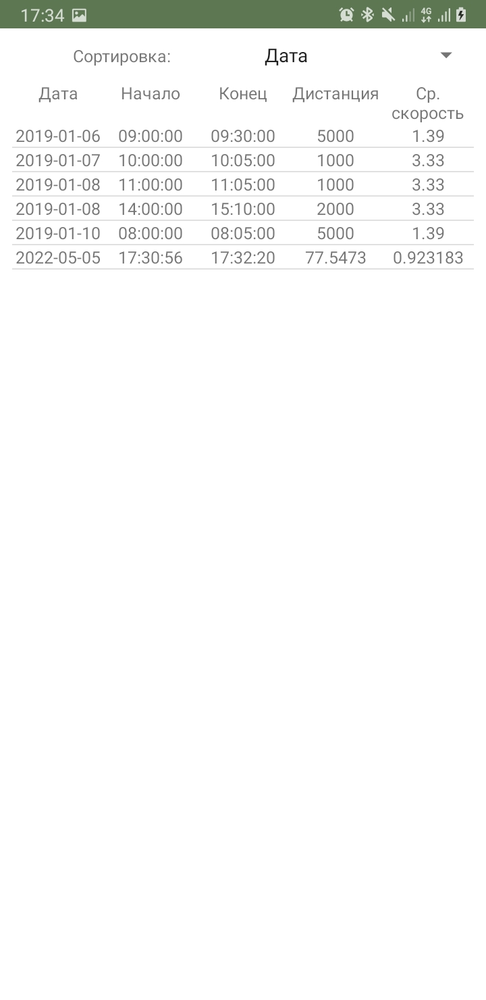
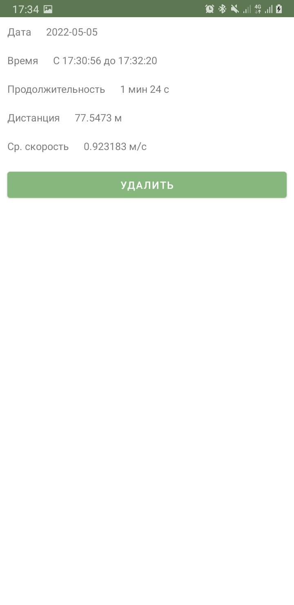
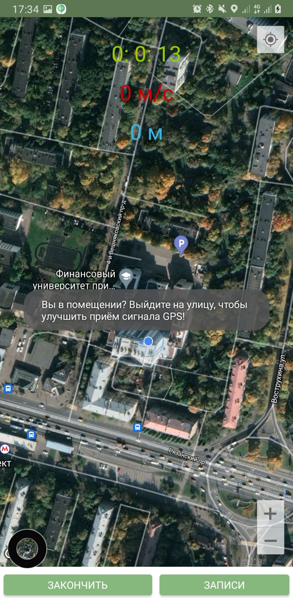
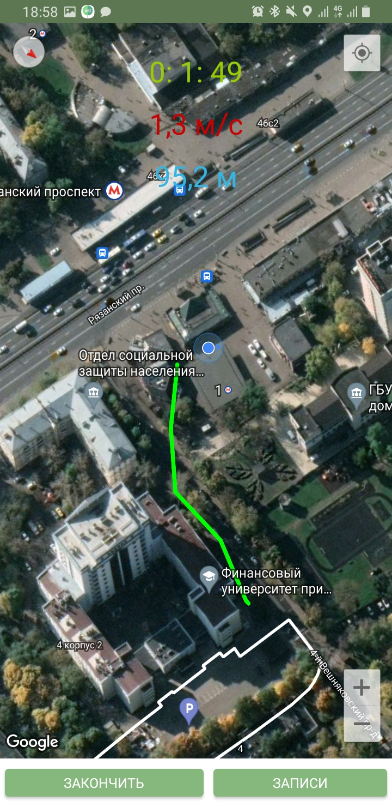
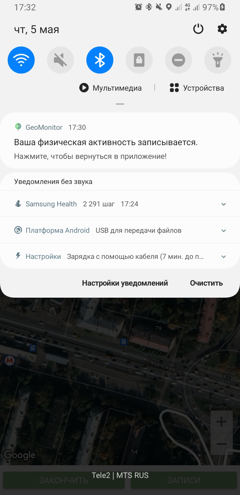

# Приложение для учёта физической активности с использованием геолокации

-Отслеживание в реальном времени скорости, пройденной дистанции, длительности активности.

-Маршрут движения отображается на Google Картах.

-Данные сохранются локально в базу данных SQLite.

-Реализована возможность просмотра и удаления детальной информации.

-Фоновая работа приложения подчеркивается висящем во время мониторинга push-уведомлением.

## Демонстрация: 

Главный экран:
​ 

История активностей:
​

Детальная информация:
​

Предупреждение о качестве сигнала:
​

Отображённый на карте маршрут и показатели активности:
​

Уведомление о работе в фоне:
​

